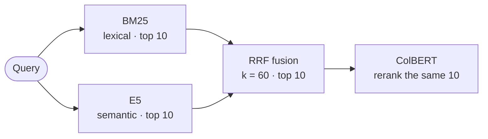

# Retrieval Lab

**Four retrieval strategies. One frozen Portuguese corpus. A reproducible evaluation.**

This lab compares BM25, dense E5, hybrid RRF, and ColBERT reranking over the same frozen Portuguese GitHub Docs corpus. It exposes intermediate rankings and evaluates Recall, nDCG, and latency. The API retrieves chunks; it does not generate answers.

[](docs/development.md#coverage)
[](pyproject.toml)

This is the implementation companion to the [Fundamentals of Information Retrieval blog series](https://www.patrickadelino.com.br/en/series/information-retrieval/). The articles explain the concepts; this repository brings them together and measures their behavior on a judged Portuguese corpus. See the [article-to-code map](#companion-to-the-blog-series).

[Results](#results) · [How it works](#how-it-works) · [Quickstart](#quickstart) · [Method and limitations](#method-and-limitations) · [Documentation](docs/README.md)

## Results

**Current baseline:** the chunker produces 50 chunks under E5's 512-token limit, with 500 query/chunk judgments across ten queries. This diagnostic pilot uses author-written queries and one annotator. Treat the results as diagnostic, not as a benchmark. See [judgment provenance](docs/evaluation.md#judgment-provenance) for details.

| Strategy | Pipeline | Mean nDCG@5 (top-5 ranking) | Mean Recall@10 (top-10 coverage) | Typical latency |
| --- | --- | ---: | ---: | ---: |
| `bm25` | BM25 | 0.782 | 91.0% | 2.37 ms |
| `dense` | E5 | 0.731 | 84.7% | 11.67 ms |
| `hybrid` | BM25 + E5 → RRF | 0.821 | 94.3% | 15.90 ms |
| `hybrid_colbert` | BM25 + E5 → RRF → ColBERT | **0.891** | 94.3% | 140.76 ms |

**How to read the metrics:** Recall@10 is the share of all chunks judged relevant (grade 1 or 2) that appear anywhere in the first ten results; it does not measure their order. nDCG@5 evaluates the graded relevance and order of the first five: grade-2 chunks count more than grade-1 chunks, and higher positions count more. Both values are averages across the ten queries; closer to 1 is better for each measure.

### What this pilot suggests

- **Fusion increased Recall@10 in this pilot.** Hybrid retrieved 94.3% of the judged relevant chunks, compared with 91.0% for BM25 and 84.7% for dense retrieval.
- **ColBERT changed ordering, not candidate coverage.** It reranks the same ten hybrid candidates, so Recall@10 is equal by construction. Mean nDCG@5 rose from 0.821 to 0.891 under these judgments, with about **8.9×** the typical latency.
- **Results varied by query.** Per-query rankings and changes are available in the [HTML report](reports/baseline/index.html); these aggregate metrics should not be read as a gain on every query.

Typical latency is the median of per-query medians across three timed runs after warmup. It includes query encoding and Qdrant, but excludes HTTP.

See the [HTML report](reports/baseline/index.html), [source JSON](reports/baseline/pilot.json), and [evaluation method](docs/evaluation.md).

## How it works

The project follows four steps: build the retrieval representations, run a strategy, inspect its ranking path, and evaluate its results.

### Build

Six frozen GitHub Docs pages are split into token-bounded chunks. Each chunk is represented as a BM25 sparse vector, an E5 embedding, and a ColBERT multivector, then stored in Qdrant.

### Search

BM25 and dense retrieval each return their top 10. Hybrid fuses the two candidate lists with RRF and returns 10; hybrid_colbert reranks those same candidates.



The API exposes each stage as a strategy: `bm25` returns the lexical ranking, `dense` returns the E5 ranking, `hybrid` returns the RRF ranking, and `hybrid_colbert` returns the ColBERT reranking.

### Inspect

Set `inspect=true` to see the intermediate BM25 and dense rankings, each candidate's RRF contribution, and the candidate set passed to ColBERT. This makes it possible to trace how a chunk reached its final position.

### Evaluate

The offline evaluator runs the four strategies against the frozen queries and qrels, then generates an HTML report with Recall, nDCG, latency, and per-query rankings.

See the [architecture and HTTP contract](docs/architecture.md).

## Quickstart

Requires Docker with Compose and internet access for the initial model downloads. The ColBERT model is about 2.2 GB.

```bash
docker compose build
docker compose up -d qdrant
docker compose run --rm -e LOG_FILE=/tmp/index-run.log api python -m hybrid_retrieval_lab.cli index
docker compose up -d api
```

Query the API:

```bash
curl -sS http://127.0.0.1:8000/search \
  -H 'Content-Type: application/json' \
  -d '{"query":"Para que serve X-GitHub-Delivery?","strategy":"hybrid_colbert","limit":5,"inspect":true}'
```

The query is in Portuguese to match the corpus. Set `inspect` to `true` to see the intermediate BM25 and dense rankings and each chunk's RRF contribution. Open the interactive [API docs](http://127.0.0.1:8000/docs).

For reindexing and clean-clone reproduction, follow the reproduction guide: [reproduction](docs/reproduction.md). The fixed collection is deleted before it is recreated, so a Qdrant write failure requires another indexing run. To develop locally, run `uv sync --locked --extra dev`, then follow the [development guide](docs/development.md) for lint, strict typing and unit/integration tests.

### Reproduce the report

The saved baseline can be viewed without running the models:

```bash
python -m http.server 8770 --bind 127.0.0.1 --directory reports/baseline
```

For a clean-clone reproduction, follow the [reproduction procedure](docs/reproduction.md). It records the Git revision, worktree state, lockfile hash, model snapshots and input hashes. Avoid running other model workloads during timing.

## Method and limitations

### What supports this comparison

The comparison uses the same frozen corpus, complete relevance judgments for the current dataset, and fixed model/chunking configuration across all strategies.
### What it cannot establish

- The queries were written by the author after reviewing the corpus, and all grades were assigned by one annotator. They are not production traffic or an independent benchmark. See [judgment provenance](docs/evaluation.md#judgment-provenance).
- The corpus has 50 chunks from one domain.
- Model size and retrieval technique are confounded: `jina-colbert-v2` is much larger than `multilingual-e5-small`, so the observed gain cannot be attributed to late interaction alone.
- ColBERT reranks only ten candidates; this experiment does not separate reranking quality from candidate generation over the full corpus.
- Latency comes from one local machine and excludes HTTP.
- `jinaai/jina-colbert-v2` is licensed CC BY-NC 4.0, which restricts commercial use.

The [HTML report](reports/baseline/index.html) contains per-query rankings, candidate coverage, latency samples and configuration details. See [evaluation methodology and limitations](docs/evaluation.md).

## Companion to the blog series

The series builds from retrieval fundamentals to hybrid search. These articles connect those concepts to their implementation in this repository.

| Article (EN-US) | Where it appears in this repository                                                                                                                                      |
| --- |--------------------------------------------------------------------------------------------------------------------------------------------------------------------------|
| [What Is Information Retrieval?](https://www.patrickadelino.com.br/en/series/information-retrieval/o-que-sao-information-retrieval/introduction/) | Overall flow: query → candidates → ranking                                                                                                                               |
| [Term-Based Retrieval: TF-IDF, Inverted Indexes, and BM25](https://www.patrickadelino.com.br/en/series/information-retrieval/term-based-retrieval/introduction/) | [`encoders/bm25.py`](src/hybrid_retrieval_lab/encoders/bm25.py), [`strategy/bm25.py`](src/hybrid_retrieval_lab/services/search/strategy/bm25.py)                         |
| [Semantic Search: Embeddings, Vectors, and Cosine Similarity](https://www.patrickadelino.com.br/en/series/information-retrieval/embeddings-busca-semantica/introduction/) | [`encoders/e5.py`](src/hybrid_retrieval_lab/encoders/e5.py), [`strategy/dense.py`](src/hybrid_retrieval_lab/services/search/strategy/dense.py)                           |
| [Chunking: Fixed-Size, Structural, and Semantic Strategies](https://www.patrickadelino.com.br/en/series/information-retrieval/chunking/introduction/) | [`ingestion/chunker.py`](src/hybrid_retrieval_lab/ingestion/chunker.py) (section-aware chunking bounded by the E5 512-token budget)                                      |
| [Vector Databases: Storage, Indexing, and Vector Search with Qdrant](https://www.patrickadelino.com.br/en/series/information-retrieval/vector-databases/why-use-a-vector-database/) | `ingestion/indexer.py` + Qdrant sparse/dense/multivector representations                                                                                                  |
| [Hybrid Search: BM25 and Embeddings, RRF, and Reranking](https://www.patrickadelino.com.br/en/series/information-retrieval/hybrid-search-reranking/when-a-question-needs-more-than-one-signal/) | [`strategy/hybrid.py`](src/hybrid_retrieval_lab/services/search/strategy/hybrid.py), [`strategy/colbert.py`](src/hybrid_retrieval_lab/services/search/strategy/colbert.py) |

More writing at [patrickadelino.com.br](https://www.patrickadelino.com.br/).

## Repository map

```text
src/hybrid_retrieval_lab/
  api/          HTTP adapter (FastAPI)
  encoders/     BM25, E5 and ColBERT adapters, token budget
  ingestion/    chunking, indexing, index manifest and verification
  services/     SearchService, strategy protocol, factory and retrieval
  evaluation/   metrics, runner and HTML report
data/           corpus, queries and relevance judgments
reports/        canonical baseline (HTML and JSON)
tests/          unit (doubles) and integration (Qdrant and encoders)
docs/           architecture, evaluation, observability and reproduction
```

## License

The original code is licensed under the [MIT License](LICENSE). The license does not apply to third-party models or the GitHub Docs corpus (CC BY 4.0); see [third-party notices](docs/third-party-notices.md).
