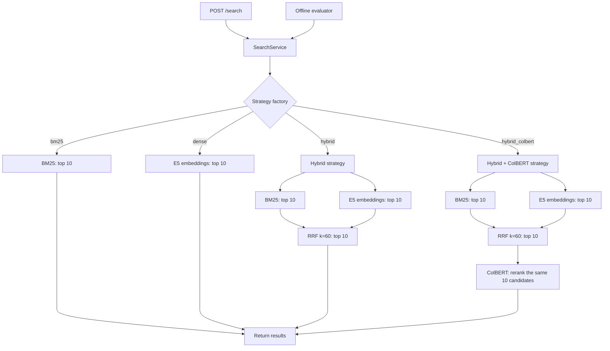

# Retrieval Lab

A Python retrieval API and an inspectable experiment comparing **BM25, dense retrieval, RRF fusion, and ColBERT reranking** over a frozen Portuguese GitHub documentation corpus. It returns ranked chunks without generating answers.

[](https://github.com/patrickadeelino/retrieval-lab/actions/workflows/quality.yml)
[](docs/development.md#coverage)

[](docs/README.md)
[](docs/development.md)
[](docs/evaluation.md)

## What the experiment shows

The reviewed pilot contains **53 chunks, 10 queries, and 530 relevance judgments**.

| Strategy | Mean nDCG@5 | Mean Recall@10 | Typical latency |
| --- | ---: | ---: | ---: |
| BM25 | 0.777 | 91.0% | 1.96 ms |
| Dense E5 | 0.713 | 84.7% | 15.45 ms |
| Hybrid RRF | 0.797 | 94.3% | 15.94 ms |
| Hybrid + ColBERT | 0.868 | 94.3% | 171.93 ms |

ColBERT improved average ordering at the top with about **10.8×** the typical latency of hybrid retrieval. It reranks the same ten candidates, so Recall@10 is unchanged by construction. The clean-clone run at commit `5e9dc69` reproduced all 40 query/strategy rankings and the quality metrics from the previous validated report; absolute latency varied. These are descriptive results from this pilot, not a general benchmark or production SLA. See the [HTML report](reports/baseline/index.html) and its [source JSON](reports/baseline/pilot.json).

Typical latency is the median of per-query medians, with three timed runs after warmup. It includes query encoding and Qdrant, but excludes HTTP. [Method and limitations](docs/evaluation.md) · [Reproduction and recovery procedure](docs/reproduction-and-recovery.md) · [Report publication status](reports/README.md).

## Retrieval flow



The factory selects one of four strategies. BM25 and dense return their own rankings; hybrid fuses both top-10 lists and keeps at most 10 candidates; hybrid_colbert reranks only those fused candidates. The service then applies the requested response limit (default 5, maximum 10). Models load lazily; documents are encoded during ingestion. [Architecture and API contract](docs/architecture.md).

## Run locally

Requires Docker with Compose, internet access for initial downloads, and disk space for Qdrant and the model cache. ColBERT downloads approximately 2.2 GB; its cache workaround may duplicate roughly that amount. Python 3.11+ is needed for local development and optional report/review servers.

From the repository root, install the exact dependency set in `uv.lock`:

```bash
uv sync --locked --extra dev
docker compose build
docker compose up -d qdrant
docker compose stop api
docker compose run --rm -e LOG_FILE=/tmp/index-run.log api python -m hybrid_retrieval_lab.cli index
docker compose up -d api
curl -sS http://127.0.0.1:8000/search \
  -H 'Content-Type: application/json' \
  -d '{"query":"Para que serve X-GitHub-Delivery?","strategy":"hybrid_colbert","limit":5,"inspect":true}'
```

The Portuguese example matches the corpus language. Open [API documentation](http://127.0.0.1:8000/docs). Strategies: `bm25`, `dense`, `hybrid`, `hybrid_colbert`. The response `limit` defaults to 5 and accepts 1–10. Inspection exposes intermediate rankings and fusion contributions.

**Indexing builds and validates a versioned collection before atomically switching the `github_docs_pilot_active` alias.** A timeout during that switch is reconciled against Qdrant before cleanup; an unknown state retains both generations for inspection. Stop the API before reindexing, then restart it to clear cached resources. Oversized chunks are skipped individually; oversized E5 queries return HTTP 422. See [index identity and token policy](docs/index-validation-and-token-budget.md) and the [recovery steps](docs/reproduction-and-recovery.md#recover-after-an-indexing-error).

Stop with `docker compose down`; named volumes retain the index and models. JSON logs are written to `logs/hybrid-retrieval-lab.log`, correlated by request ID. [Logging configuration](docs/observability.md).

## Reproduce the report

The canonical clean-clone baseline is available as the [HTML report](reports/baseline/index.html) and [machine-readable JSON](reports/baseline/pilot.json). The report records rankings, quality metrics, latency samples, input hashes, model snapshots and runtime provenance.

To inspect the report locally, serve the saved HTML without rerunning evaluation:

```bash
python -m http.server 8770 --bind 127.0.0.1 --directory reports/baseline
```

Follow the [clean-clone reproduction procedure](docs/reproduction-and-recovery.md). It records the Git revision, worktree state, lockfile hash, model snapshots and input hashes. Avoid concurrent model workloads while timing. The evaluator validates the index identity before searching. [Evaluation method and limitations](docs/evaluation.md).

## Review relevance judgments

```bash
python scripts/review_qrels.py
```

Open [the review screen](http://127.0.0.1:8765) to inspect every chunk and edit grades and reasons. Changes save immediately to `data/qrels/pilot-proposed.jsonl`; despite its historical name, it contains reviewed judgments. Use `--port 8766` if necessary; stop with `Ctrl+C`. [Relevance rubric](docs/evaluation.md#relevance-rubric).

## Development and status

Unit tests use explicit doubles without Qdrant or downloads. Integration tests use real Qdrant and encoders in isolated collections. Ruff checks lint/format; mypy runs strictly over source and scripts. GitHub Actions is configured for **unit tests and static checks only**. The CI badge tracks the main-branch workflow. The coverage badge shows the latest unit-test coverage (including branches) and is updated manually after running the coverage command documented in [coverage setup and reports](docs/development.md#coverage). Integration coverage is measured separately; coverage spans the Python package and scripts.

See the [development guide](docs/development.md) and [documentation index](docs/README.md). The project is published as [patrickadeelino/retrieval-lab](https://github.com/patrickadeelino/retrieval-lab).

## License

The original code in this repository is licensed under the [MIT License](LICENSE). This license does not apply to third-party models or the GitHub Docs corpus; see [third-party notices](docs/third-party-notices.md). In particular, `jinaai/jina-colbert-v2` declares **CC BY-NC 4.0**, which restricts commercial use.
