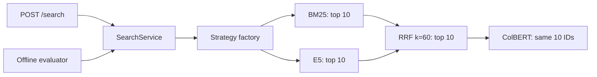

# Hybrid Retrieval Lab

A Python retrieval API and an inspectable experiment comparing **BM25, dense retrieval, RRF fusion, and ColBERT reranking** over a frozen Portuguese GitHub documentation corpus. It returns ranked chunks without generating answers.

[](docs/README.md)
[](docs/development.md)
[](docs/evaluation.md)

## What the experiment shows

The reviewed pilot contains **53 chunks, 10 queries, and 530 relevance judgments**.

| Strategy | Mean nDCG@5 | Mean Recall@10 | Typical latency |
| --- | ---: | ---: | ---: |
| BM25 | 0.777 | 91.0% | 2.21 ms |
| Dense E5 | 0.713 | 84.7% | 14.18 ms |
| Hybrid RRF | 0.797 | 94.3% | 13.95 ms |
| Hybrid + ColBERT | 0.868 | 94.3% | 154.46 ms |

ColBERT improved average ordering at the top with about **11.1×** the typical latency of hybrid retrieval. It reranks the same ten candidates, so Recall@10 is unchanged by construction. These are descriptive results for this small pilot, not a general benchmark or production SLA.

Typical latency is the median of per-query medians, with three timed runs after warmup. It includes query encoding and Qdrant, but excludes HTTP. [Method and limitations](docs/evaluation.md) · [Saved results](reports/ten-query-validated/pilot.json) · [Fresh-install report](reports/clean-install-validation/index.html).

## Retrieval flow



The selected strategy determines where the pipeline stops. The service then applies the response limit. Models load lazily; documents are encoded during ingestion. [Architecture and API contract](docs/architecture.md).

## Run locally

Requires Docker with Compose, internet access for initial downloads, and disk space for Qdrant and the model cache. ColBERT downloads approximately 2.2 GB; its cache workaround may duplicate roughly that amount. Python 3.11+ is needed for local development and optional report/review servers.

From the repository root:

```bash
docker compose up -d --build
docker compose run --rm api python -m hybrid_retrieval_lab.cli index
curl -sS http://127.0.0.1:8000/search \
  -H 'Content-Type: application/json' \
  -d '{"query":"Para que serve X-GitHub-Delivery?","strategy":"hybrid_colbert","limit":5,"inspect":true}'
```

The Portuguese example matches the corpus language. Open [API documentation](http://127.0.0.1:8000/docs). Strategies: `bm25`, `dense`, `hybrid`, `hybrid_colbert`. The response `limit` defaults to 5 and accepts 1–10. Inspection exposes intermediate rankings and fusion contributions.

**Indexing builds and validates a versioned collection before atomically switching the `github_docs_pilot_active` alias.** The previous generation remains available until the switch succeeds. Oversized chunks are skipped individually; oversized E5 queries return HTTP 422. See [index identity and token policy](docs/index-validation-and-token-budget.md). Restart the API after changing index configuration to clear cached resources: `docker compose restart api`.

Stop with `docker compose down`; named volumes retain the index and models. JSON logs are written to `logs/hybrid-retrieval-lab.log`, correlated by request ID. [Logging configuration](docs/observability.md).

## Explore or reproduce the report

View the saved report without running models:

```bash
python -m http.server 8770 --bind 127.0.0.1 --directory reports/ten-query-validated
```

Open [the report](http://127.0.0.1:8770/). Its original Portuguese interface is preserved; newly generated reports use English labels and retain Portuguese source data. GitHub's file viewer does not render report HTML as a website.

For a new evaluation against the indexed corpus, use a separate directory:

```bash
docker compose run --rm api python -m hybrid_retrieval_lab.cli evaluate \
  --reviewed-qrels --output reports/local-run
python -m http.server 8772 --bind 127.0.0.1 --directory reports/local-run
```

Avoid concurrent model workloads while timing. The evaluator validates the index identity before searching. The clean installation reproduced all 40 saved rankings and all relevance metrics; see the [validation notes](docs/clean-install-validation.md). [Evaluation guide](docs/evaluation.md).

## Review relevance judgments

```bash
python scripts/review_qrels.py
```

Open [the review screen](http://127.0.0.1:8765) to inspect every chunk and edit grades and reasons. Changes save immediately to `data/qrels/pilot-proposed.jsonl`; despite its historical name, it contains reviewed judgments. Use `--port 8766` if necessary; stop with `Ctrl+C`. [Relevance rubric](docs/evaluation.md#relevance-rubric).

## Development and status

Unit tests use explicit doubles without Qdrant or downloads. Integration tests use real Qdrant and encoders in isolated collections. Ruff checks lint/format; mypy runs strictly over source and scripts. GitHub Actions is configured for **unit tests and static checks only**. The badges above are navigation labels, not passing remote CI claims.

See [development commands](docs/development.md), [phase checklist](docs/phase-7-plan.md), and [documentation map](docs/README.md). The local clean-install walkthrough is recorded in [the validation report](docs/clean-install-validation.md). Publication and a GitHub Actions run on the remote remain follow-up tasks.

## License

The original code in this repository is licensed under the [MIT License](LICENSE). This license does not apply to third-party models or the GitHub Docs corpus; see [third-party notices](docs/third-party-notices.md). In particular, `jinaai/jina-colbert-v2` declares **CC BY-NC 4.0**, which restricts commercial use.
